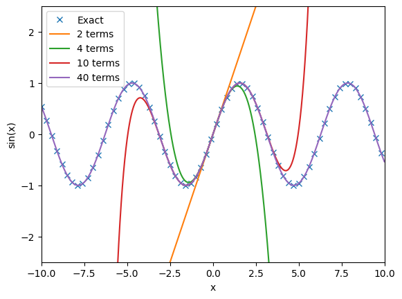

# Exercise 0: Brief introduction to Python

Python is a well-established and (relatively) easy to learn programming language. It is broadly applied also for general purpose programming, but it also has many well established libraries and tools for numerical computing.

We start by import the relevant packages:
- `numpy`: to manipulate numerical data, matrices, arrays, and much more (commonly abbreviated `np`)
- `scipy`: for advanced functions and operations
- `matplotlib`: for plotting utilities (with `matplotlib.pyplot` commonly abbreviated as `plt`)


```python
import numpy as np
import scipy
import matplotlib.pyplot as plt
```

## Defining variables and matrices

We will typically store relevant values (matrix dimensions, matrices, function values) in variables. This can be done in Python as follows.


```python
# This is a comment, it is not evaluated and can be used to add "documentation" to the code you write so you understand it later

# The dimension of our matrix
dim = 2

# The x Pauli matrix (not yet initialized)
pauli_x = np.zeros((dim, dim))

print(f"Dim = {dim}")
print("Pauli x matrix (not yet initialized):")
print(pauli_x)
```

    Dim = 2
    Pauli x matrix (not yet initialized):
    [[0. 0.]
     [0. 0.]]


Above, we made use of the [`numpy` function `np.zeros`](https://numpy.org/doc/stable/reference/generated/numpy.zeros.html) to create an empty matrix with dimensions `dim`x`dim` (click on the link to visit the documentation of the function).

# Modifying variables

Our variables can also by modified by doing another assignment, which we can use to set the matrix elements of the Pauli matrix.


```python
pauli_x[1, 0] = 1
print(pauli_x)
pauli_x[0, 1] = 1
print(pauli_x)

# Fully initialized.
```

    [[0. 0.]
     [1. 0.]]
    [[0. 1.]
     [1. 0.]]


Standard arithmetic operations are also supported, as are many typical operations for matrices


```python
# Operations on numbers
a = 3
b = 5
c = a + b
d = a - b
e = a * b
f = a / b
print(f"a + b = {c}")
print(f"a - b = {d}")
print(f"a * b = {e}")
print(f"a / b = {f}")

# Operations on matrices
pauli_z = np.diag([1.0, -1.0])
x_z = pauli_x @ pauli_x
print("Matrix multiply of Pauli x and z matrices:")
print(x_z)
negative_x_z = -1 * x_z
print(negative_x_z)
```

    a + b = 8
    a - b = -2
    a * b = 15
    a / b = 0.6
    Matrix multiply of Pauli x and z matrices:
    [[1. 0.]
     [0. 1.]]
    [[-1. -0.]
     [-0. -1.]]


## Diagonalizing matrices

One operation that is common in computational physics is diagonalizing matrices. This is provided by the [`scipy.linalg.eigh` function](https://docs.scipy.org/doc/scipy-1.15.0/reference/generated/scipy.linalg.eigh.html) (where the "h" in `eigh` means that we ensure that the input matrix is Hermitian). We can use this to diagonalize the Pauli matrices.


```python
x_eigen_values, x_eigen_vectors_transpose = scipy.linalg.eigh(pauli_x)

print("Eigenvalue and vector at index 0:")
print(f"Eigenvalue = {x_eigen_values[0]}")
print(f"Eigenvector = {x_eigen_vectors_transpose[:, 0].T}")
print("Eigenvalue and vector at index 1:")
print(f"Eigenvalue = {x_eigen_values[1]}")
print(f"Eigenvector = {x_eigen_vectors_transpose[:, 1].T}")

# Note that the eigenvectors are return as columns, not rows, of the "x_eigen_vectors_transpose"
print(x_eigen_vectors_transpose)
```

    Eigenvalue and vector at index 0:
    Eigenvalue = -1.0
    Eigenvector = [-0.70710678  0.70710678]
    Eigenvalue and vector at index 1:
    Eigenvalue = 1.0
    Eigenvector = [0.70710678 0.70710678]
    [[-0.70710678  0.70710678]
     [ 0.70710678  0.70710678]]


## Loops

As you can see above, we have the same code for index 0 and 1. If we only have two indices, this duplication is fine, but loops allow us to do the same code for many indices in a row (e.g., 1, ... 1000000).

The standard loop in Python is the for loop:


```python
for i in range(dim):
    print(f"Index = {i}")
    print(f"Eigenvalue and vector at index {i}:")
    print(f"Eigenvalue = {x_eigen_values[i]}")
    print(f"Eigenvector = {x_eigen_vectors_transpose[:, i].T}")
```

    Index = 0
    Eigenvalue and vector at index 0:
    Eigenvalue = -1.0
    Eigenvector = [-0.70710678  0.70710678]
    Index = 1
    Eigenvalue and vector at index 1:
    Eigenvalue = 1.0
    Eigenvector = [0.70710678 0.70710678]


The `range(end)` function will generate the values `i` from `0` to `end - 1` in order, allowing one to easily work over many indices.

It is often the case that one wants to do a loop, but may want to exit early if some condition has been met (for example, a Taylor series has converged to the desired numerical precision). This can be accomplished via the `break` keyword, which exits a loop early. As an example, if we wanted to find the smallest common multiple of 2, 3, 4, and 6, we could write the following code:


```python
worst_case = 2 * 3 * 4 * 6

# Loop from 1 to worst_case
for i in range(1, worst_case + 1):
    if (i % 2 == 0) and (i % 3 == 0) and (i % 4 == 0) and (i % 6 == 0):
        print(f"Found common multiple of 2, 3, 4, 6 at {i}")
```

    Found common multiple of 2, 3, 4, 6 at 12
    Found common multiple of 2, 3, 4, 6 at 24
    Found common multiple of 2, 3, 4, 6 at 36
    Found common multiple of 2, 3, 4, 6 at 48
    Found common multiple of 2, 3, 4, 6 at 60
    Found common multiple of 2, 3, 4, 6 at 72
    Found common multiple of 2, 3, 4, 6 at 84
    Found common multiple of 2, 3, 4, 6 at 96
    Found common multiple of 2, 3, 4, 6 at 108
    Found common multiple of 2, 3, 4, 6 at 120
    Found common multiple of 2, 3, 4, 6 at 132
    Found common multiple of 2, 3, 4, 6 at 144


This code will search for all values up to the worst case of 144 = 2 * 3 * 4 * 6. We can just break after finding the first case, because then we have achieved our goal.


```python
worst_case = 2 * 3 * 4 * 6

# Loop from 1 to worst_case
for i in range(1, worst_case + 1):
    if (i % 2 == 0) and (i % 3 == 0) and (i % 4 == 0) and (i % 6 == 0):
        print(f"Found least common multiple of 2, 3, 4, 6 at {i}")
        break
```

    Found least common multiple of 2, 3, 4, 6 at 12


## Defining functions

A principle of good programming is defining functions with clear inputs and outputs for "logical operations." This has two benefits:

1. Functions can be named according to what they do, and this makes the bigger code around the function more readable. As an example, consider:
```Python
# Option 1
a = np.zeros((10))

# Option 2
b = np.array([0.0] * 10)
```
    Both options yield the same result, but option 1 is much clearer that you are generating an array of 10 zeros.

2. Functions can be reused in many different places, which means you have to write less code and are less likely to make mistakes.


Let us start by defining a factorial function `factorial(n)`, which takes $n$ as input and will give us $n!$ as output.


```python
def factorial(n):
    result = 1
    # Loop from 1 to n
    for n in range(1, n + 1):
        result *= n
    return result

for i in range(10):
    print(f"factorial({i}) = {factorial(i)}")
```

    factorial(0) = 1
    factorial(1) = 1
    factorial(2) = 2
    factorial(3) = 6
    factorial(4) = 24
    factorial(5) = 120
    factorial(6) = 720
    factorial(7) = 5040
    factorial(8) = 40320
    factorial(9) = 362880


We can put all of this together to define a function that evaluates the Taylor series of sine of x up to a max number of terms and to a given desired precision:


```python
def sin_taylor_series(x, max_terms=50, precision=1e-6):
    # This evaluates the value of sin of x using a Taylor series
    # It includes the terms i = 0, ..., max_terms - 1 (default: max_terms = 50)
    # And it will stop early once the current term is smaller than precision (default: precision = 0.000001 = 1e-6)

    result = 0.0

    for i in range(max_terms):
        if i % 2 == 0:
            result += 0
        else:
            term = np.real(1j ** (i - 1)) * (x ** i) / factorial(i)
            result += term
            if np.abs(term) < precision:
                break

    return result

val = 1.0
print(f"Sin({val}) = {np.sin(val)}")
for max_terms in range(1, 20, 2):
    print(f"{max_terms} terms = {sin_taylor_series(val, max_terms=max_terms)}")
```

    Sin(1.0) = 0.8414709848078965
    1 terms = 0.0
    3 terms = 1.0
    5 terms = 0.8333333333333334
    7 terms = 0.8416666666666667
    9 terms = 0.841468253968254
    11 terms = 0.8414710097001764
    13 terms = 0.841470984648068
    15 terms = 0.841470984648068
    17 terms = 0.841470984648068
    19 terms = 0.841470984648068


## Plot

We can also visualize the performance of this function by plotting the results.


```python
x_vals = np.arange(-10, 10, 0.3)
x_vals_dense = np.arange(-10, 10, 0.01)
exact = np.sin(x_vals)

plt.plot(x_vals, exact, "x", linewidth=3, label="Exact")

for max_terms in [2, 4, 10, 40]:
    approx = [sin_taylor_series(x, max_terms) for x in x_vals_dense]
    plt.plot(x_vals_dense, approx, "-", label=f"{max_terms} terms")

plt.legend(loc="best")
plt.ylim(-2.5, 2.5)
plt.xlim(-10, 10)
plt.xlabel("x")
plt.ylabel("sin(x)")
plt.show()
```


    

    


Hopefully this has introduced you to (or reminded you of) the basic Python tools you will need for these exercises.
